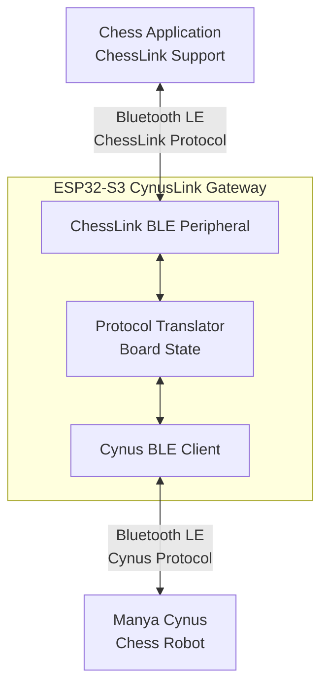
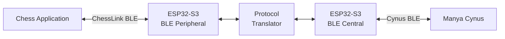
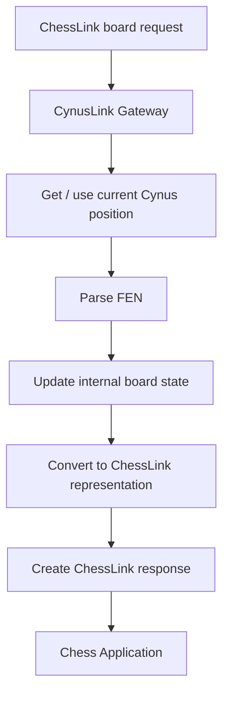
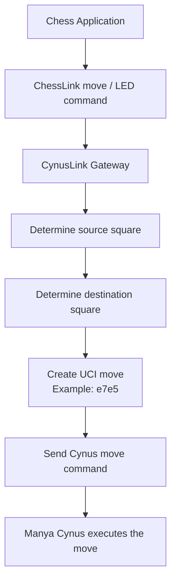
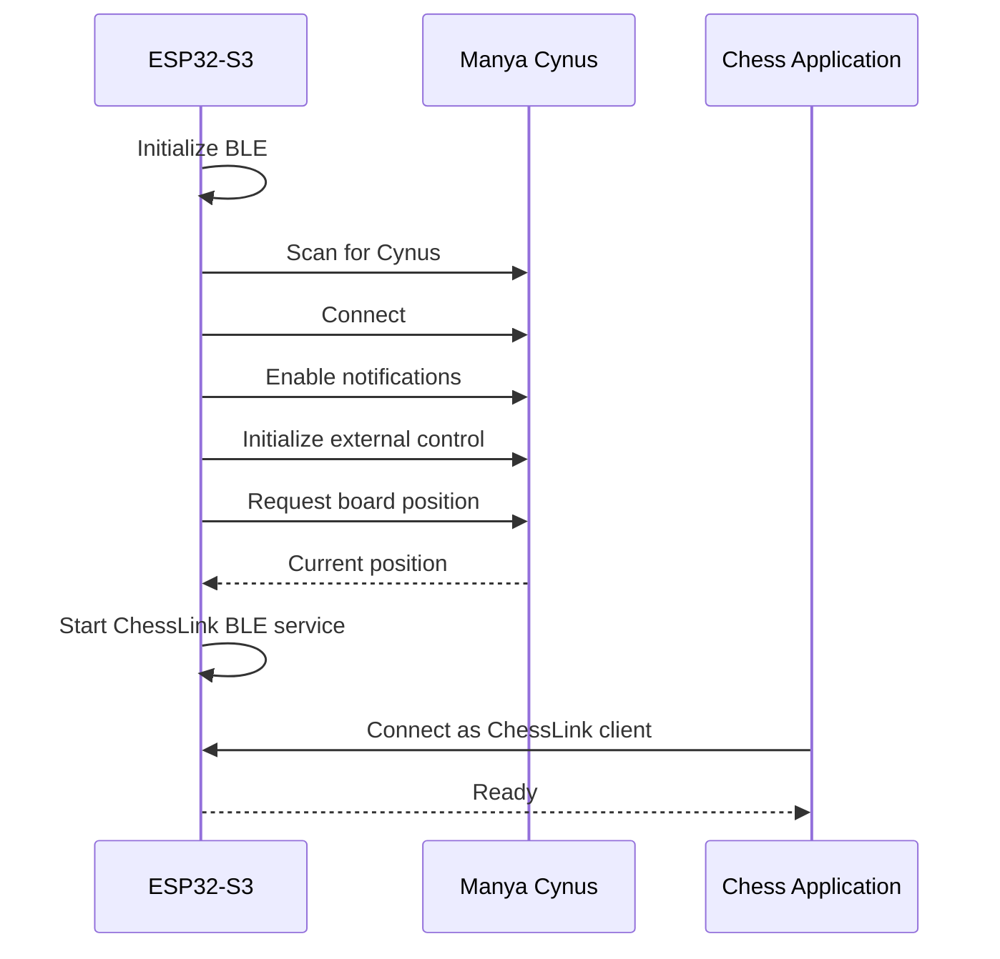
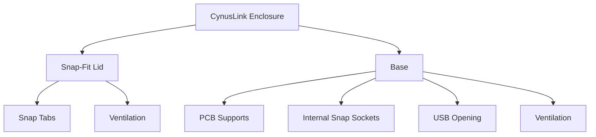

# CynusLink

**Bluetooth LE gateway between ChessLink-compatible chess software and the Manya Cynus chess robot, powered by an ESP32-S3.**

> **Project status:** Experimental / Work in Progress

## Overview

The Manya Cynus chess robot uses its own Bluetooth Low Energy protocol, while many chess applications already support the Millennium ChessLink protocol.

**CynusLink** bridges these two worlds. An ESP32-S3 connects to the Cynus as a BLE client while simultaneously presenting itself to the chess application as a ChessLink-compatible BLE device.

The goal is a small, standalone gateway that requires only USB power.

## Architecture



## Main Components

| Component | Function |
| --- | --- |
| **ESP32-S3 DevKitC-1 compatible board** | Runs both BLE connections and translates the protocols |
| **Manya Cynus** | Physical chess robot |
| **ChessLink-compatible application** | Chess GUI or application communicating with the gateway |
| **USB-C cable / power supply** | Powers and programs the ESP32-S3 |
| **3D-printed enclosure** | Screwless protection for the gateway hardware |

The current enclosure is designed around an **ESP32-S3-WROOM-1 / ESP32-S3-DevKitC-1 style board**.

## BLE Roles

The ESP32-S3 performs two BLE roles at the same time:



### ChessLink side

Toward the computer, tablet or phone, CynusLink behaves as a **BLE Peripheral / GATT Server**.

The chess application should see the ESP32-S3 as a ChessLink-compatible device.

The initial implementation focuses on the ChessLink functions required for practical play, including:

- board status
- version information
- move / LED indications
- clearing indications
- checksum handling

### Cynus side

Toward the robot, CynusLink behaves as a **BLE Central / GATT Client**.

The gateway connects to the Cynus, receives board information and sends robot commands.

Typical Cynus commands used by the gateway include:

```text
get fen
scan board
move e2e4
```

## Protocol Translation

### Cynus to ChessLink

When the chess application asks for the board position, CynusLink converts the Cynus position into the representation expected by ChessLink.



### ChessLink to Cynus

When the chess application indicates a computer move, CynusLink translates that information into a move the Cynus can physically execute.



## Internal Board State

CynusLink maintains its own representation of the current chess position.

This is needed for:

- translating FEN into ChessLink board data
- detecting and validating moves
- interpreting ChessLink move indications
- source and destination square detection
- castling
- en passant
- promotion
- synchronization after reconnects

## Firmware Architecture

The firmware is divided into separate layers so that BLE transport, protocol handling and chess logic remain independent.

```text
src/
├── main.cpp
├── ble_chesslink_server.cpp
├── ble_cynus_client.cpp
├── chesslink_protocol.cpp
├── cynus_protocol.cpp
├── board_state.cpp
└── gateway.cpp

include/
├── ble_chesslink_server.h
├── ble_cynus_client.h
├── chesslink_protocol.h
├── cynus_protocol.h
├── board_state.h
└── gateway.h
```

### Module responsibilities

| Module | Responsibility |
| --- | --- |
| `ble_chesslink_server` | BLE peripheral and GATT server presented to the chess application |
| `ble_cynus_client` | Discovery, connection, notifications and communication with the Cynus |
| `chesslink_protocol` | ChessLink parsing, encoding and checksum handling |
| `cynus_protocol` | Cynus command and response handling |
| `board_state` | FEN, squares, positions and UCI move representation |
| `gateway` | Translation and coordination between both protocols |

## Startup Sequence



## 3D-Printed Enclosure

A custom screwless enclosure is being developed for the ESP32-S3 gateway.

### Design goals

- two-piece snap-fit construction
- no screws
- internal PCB supports
- access to USB
- ventilation
- compact size
- standard FDM printing
- little or no support material



### Suggested print settings

| Setting | Starting value |
| --- | --- |
| Layer height | 0.20 mm |
| Walls | 3 |
| Material | PETG |
| Supports | None where possible |

PETG is recommended for the final enclosure because the snap-fit features benefit from its flexibility. PLA is suitable for prototypes.

## Software Stack

- **ESP32-S3**
- **C / C++**
- **PlatformIO**
- **Arduino framework or ESP-IDF**
- **NimBLE**

NimBLE is a good fit because the gateway must maintain BLE client and peripheral functionality simultaneously.

## Development Roadmap

- [x] Select ESP32-S3 hardware
- [x] Design initial screwless enclosure
- [ ] Establish Cynus BLE connection
- [ ] Read Cynus board position
- [ ] Implement Cynus protocol handler
- [ ] Emulate ChessLink BLE services
- [ ] Implement ChessLink checksum handling
- [ ] Implement ChessLink board-status response
- [ ] Convert Cynus FEN to ChessLink board state
- [ ] Decode ChessLink move / LED commands
- [ ] Translate moves to UCI notation
- [ ] Send moves to the Cynus robot
- [ ] Handle castling
- [ ] Handle en passant
- [ ] Handle promotion
- [ ] Implement automatic BLE reconnection
- [ ] Test with ChessLink-compatible applications
- [ ] Finalize enclosure
- [ ] Release first usable firmware

## Repository Structure

```text
CynusLink/
├── README.md
├── LICENSE
├── platformio.ini
├── src/
├── include/
├── docs/
│   ├── protocol/
│   └── images/
└── hardware/
    ├── stl/
    └── openscad/
```

## Project Scope

CynusLink is an independent interoperability project.

The initial goal is not to reproduce every feature of every Millennium device. Instead, the project aims to implement the subset of the ChessLink protocol required for reliable play with the Manya Cynus.

Additional commands and compatibility work can be added as testing reveals what different chess applications require.

## Contributing

Contributions and test results are welcome, especially:

- BLE traces and protocol observations
- compatibility reports from different chess applications
- firmware improvements
- protocol implementation improvements
- enclosure improvements
- documentation

## Disclaimer

CynusLink is an unofficial community project and is not affiliated with, endorsed by, or sponsored by Manya or Millennium.

Product and protocol names are used solely to describe interoperability with the respective hardware.

Use the firmware and hardware designs at your own risk.

## License

A final license has not yet been selected.

A possible setup is:

- **Firmware:** MIT or Apache-2.0
- **3D models:** Creative Commons
